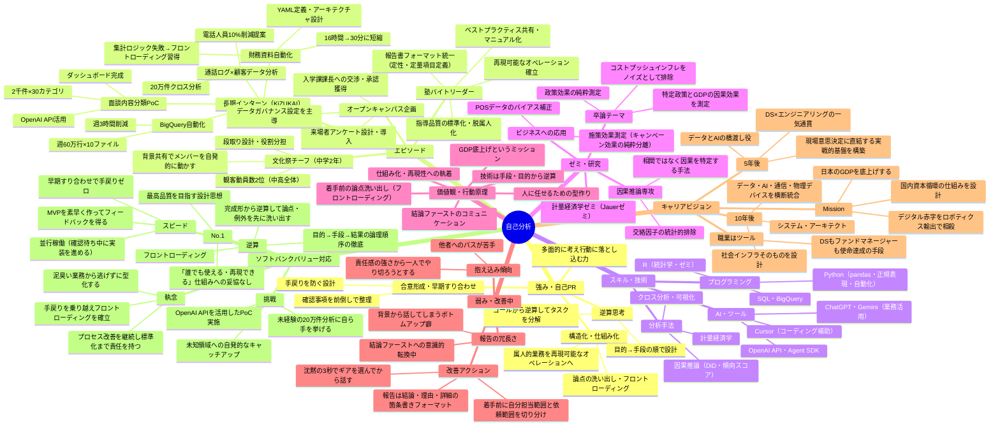

# 自己分析 マインドマップ

> **表示方法：** Obsidianで `Desktop/knowledge` フォルダをVaultとして開いてこのファイルを参照すると、下のコードブロックがグラフィカルなマインドマップとして表示されます。

---

---

## 各ノードの詳細参照先

| ノード | 詳細ファイル |
|---|---|
| 強み・自己PR | `components/self_pr.md` |
| エピソード（インターン） | `md/03_インターン_財務資料自動化.md`、`md/04_インターン_分析設計とコミュニケーション失敗.md` |
| エピソード（塾バイト） | `md/05_バイト_塾バイトリーダー指導品質標準化.md` |
| エピソード（OC企画） | `md/06_課外活動_中学文化祭チーフ.md` ※OC企画はIndex参照 |
| ゼミ・研究 | `md/08_学業_計量経済学ゼミ因果推論.md` |
| 弱み | `components/other.md カテゴリ3` |
| キャリアビジョン | `components/other.md カテゴリ5・7` |
| ソフトバンク面接回答 | `company-info/ソフトバンク/面接回答集.md` |
