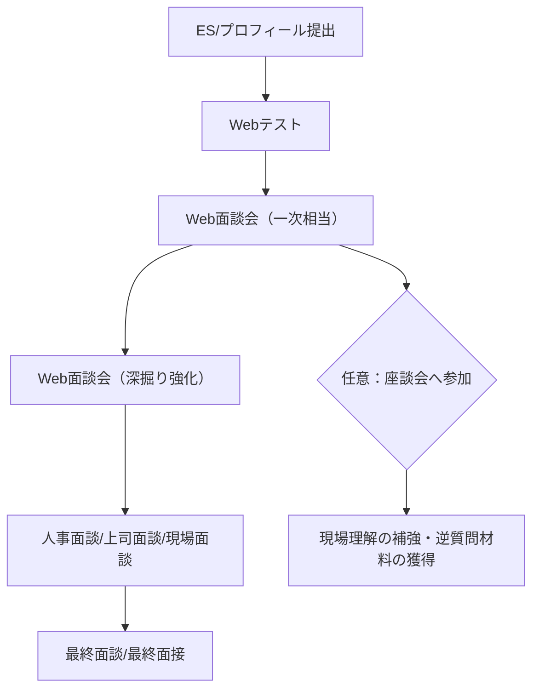

# リソナグループの一次面接として案内されるWeb面談会 実態分析レポート

## Executive Summary

本レポートは、一次選考として案内されがちな「Web面談会（Web面談／WEB個別面談会等）」について、**名目（面談）と実態（スクリーニング面接）**のズレを前提に、実務で再現できる対策へ落とし込んだものです。応募職種の指定がないため、分析は「総合職／営業／コンサル／デジタル系」相当を想定し、面接言語は日本語と仮定しています（職種・コースが分かれば質問の“クセ”と深掘り角度をさらに絞れます）。citeturn3view0turn12view0turn18view0turn19view0

- **形式の実態**：呼称は「面談会」でも、実態は**オンライン1対1（人事中心）・30〜40分の面接**であるケースが複数の体験談で確認できます。Zoom利用や「URLから接続→招待まで待機」型の運用も繰り返し登場します。citeturn12view0turn18view0turn19view0turn16view0  
- **“面談”の位置づけ**：一次相当のWeb面談が複数回（一次→二次相当）続く例、Web面談後に**任意の座談会**へ案内される例、別名（例：precious meeting）で“合否が明示されないが実質選抜”として機能する例が見られます。citeturn19view0turn18view0turn16view2turn13view0  
- **評価の軸（推定）**：初期は専門知識よりも、①一貫性（過去→今→志望理由）、②誠実さ・対人コミュニケーション、③志望度と言語化、④活動選択理由（なぜそれを選び頑張れたか）など“人柄×ロジック”が中心になりやすい、という示唆が複数ソースで一致します。citeturn12view0turn4view0turn25view2turn18view0  
- **質問の頻出**：自己紹介、学生時代の取り組み（深掘り多め）、志望理由（金融／銀行／りそな）、就活軸、強み弱み、他社状況・志望度、（コース選択がある場合）併願と優先順位、が反復して出ています。citeturn12view0turn4view0turn16view0turn25view2  
- **会社理解で差が付く“使いどころ”**：りそなのパーパス「金融＋で、未来をプラスに。」や、金融の枠にとどまらない価値提供（信託機能を含む顧客課題起点のソリューション）を、**自分の経験の“問題設定→提案→実行”**に接続できると、志望動機の説得力が上がります。citeturn20search1turn20search11turn20search4  

以降、ユーザー指定の7系統（実態確認／根拠確認／抽象語の具体化／実装方式／現場業務への落とし込み／突っ込まれポイント／自分との接続と反論耐性）に沿って整理します。citeturn12view0turn18view0turn3view0turn25view2  

## 実態確認

### 名目と実態の差

- 「Web面談会」「Web面談」「WEB個別面談会」といった名称でも、体験談上は**“普通に面接（質問＋深掘り＋通過連絡）”**として扱われています（“面談だから気楽に”と言われても、質問は面接同等だったという記述もある）。citeturn18view0turn5view0turn12view0  
- 30分枠が多い一方、**40分程度**のケースも確認でき、いずれも**人事1名：学生1名**が基本形として複数年度・複数コースで登場します。citeturn12view0turn18view0turn4view0turn16view0  
- 運用目的として、**コース併願者の“志望整理（優先順位を決めさせる）”**に使われているという証言があり、単願だとこのWeb面談が省かれる可能性が示唆されています（＝候補者の“意思決定の確からしさ”を測る機能）。citeturn12view0  

### 会社側の前提として押さえるべき応募設計

- 新卒側ではコース（職種）体系があり、最大4コースまで併願できる旨が公式FAQに記載されています（コース選択はWeb面談の質問設計に直結しやすい）。citeturn3view0turn2view0  
- グループとしては、少なくとも新卒採用情報上で「りそな銀行・埼玉りそな銀行の合同採用」が示されています（応募・配属文脈での“グループ”理解に関係）。citeturn20search3turn3view0  
  - ここでの「りそな銀行」「埼玉りそな銀行」「りそなアセットマネジメント」「りそなホールディングス」「関西みらい銀行」「みなと銀行」は、グループ文脈で混在しうるため、面談中の社名・配属の話題で混乱しないよう注意が必要です。citeturn20search3  

### 面談形式比較表

| 形式（案内される呼称の例） | 実態（選考性） | 個人/集団 | ツール/接続 | 時間目安 | 人数（社員:学生） | 進行役/面接官の典型 | 目的の推定 |
|---|---|---|---|---:|---:|---|---|
| WEB面談会（一次相当） | 通過連絡があり、質問＋深掘り＝実質面接 | 個人 | Zoom＋面接後に座談会参加確認 | 30分 | 1:1 | 採用担当者 | スタンダード質問で一貫性・人柄を確認、次ステップへ接続 citeturn18view0 |
| WEB面談会（二次相当） | 深掘り強化（“なぜ頑張れた”“原体験”） | 個人 | 指定URL→Zoomログイン→招待待機 | 30分（超過例あり） | 1:1 | 採用担当者（女性の例） | “理由の理由”まで掘り、志望理由の耐久性を検証 citeturn19view0 |
| WEB個別面談会 | 通過連絡あり、オーソドックス面接 | 個人 | 接続開始→面接開始（オンライン） | 40分程度 | 1:1 | 中堅人事 | コース併願者の整理・志望度確認（単願は省略示唆） citeturn12view0 |
| Web面談 | 面談30分＋任意座談会30分 | 個人 | URLから接続（オンライン） | 30分＋任意30分 | 1:1 | 若手人事部社員 | 実績深掘り＋“りそなでやりたいこと”の確認、座談会で情報補完 citeturn16view0turn16view2 |
| precious meeting（例） | 合否明示なしでも後日連絡→リクルーター化等、実質選抜の示唆 | 個人 | オンライン | 30分 | 1:1 | 中堅人事 | 4分スピーチ＋逆質問中心で、会話力・志望整理・理解度を短時間で点検 citeturn13view0 |

### 選考フローの“現実的な見立て”

Web面談会を一次として置いた場合、体験談ベースでは「Web面談（一次相当）→Web面談（二次相当）→（人事面談等）→最終」や、「precious meeting→ES→WEB個別面談会→（人事担当者との面談会）→（上司面談）→内定」といった揺れ幅が見えます。citeturn19view0turn18view0turn13view0turn12view0turn16view2  

（上図は、複数年度の体験談に出ている“反復パターン”を統合した概念図です。citeturn19view0turn16view2turn13view0turn12view0）

## 根拠確認

本件は、公式に「Web面談会＝一次面接」と明言されたページが常時公開されているとは限らないため、**公式情報（制度の骨格）×体験談（運用の実態）×掲示板/口コミ（例外・揺れ）**で三角測量しています。citeturn3view0turn12view0turn24view2turn25view2  

- **公式（制度・言葉の定義）**  
  - コース体系や併願可能数など、“面談で聞かれうる論点を生む制度”は公式FAQ・採用情報で確認できます。citeturn3view0turn2view0turn20search3  
  - パーパスや理念体系など、“志望動機で使うべき企業側の言語”は採用サイトやグループ公式で確認できます。citeturn20search1turn20search4turn20search11  
- **体験談（運用実態の一次情報）**  
  - 「WEB面談会（実際は一次面接）」のように、**名目と実態の差**がタイトル・本文で明示され、時間・人数・ツール・質問の粒度まで記載があります。citeturn18view0turn19view0turn12view0turn4view0  
  - “併願者はここでコースを絞る／単願は面接なし”など、制度×運用の接合点が語られており、対策上の価値が高い一方、年度・ルートで変動しうる点は留保が必要です。citeturn12view0turn16view2  
- **掲示板・口コミ（例外の探索）**  
  - 掲示板では「Web面談会が集団か個人か」「表記（個別面談会）で区別される」等、運用の揺れに関する会話が見られます（信頼度は体験談より低いので、**“あり得る例外”の把握**に使う）。citeturn24view2  
  - 口コミでは、一次がZoomでのパーソナル中心、人事は専門知識より人柄確認、という方向性が示されています（新卒・中途混在があるため、使う際は“初期面接の一般特徴”として限定）。citeturn25view2  

## 抽象語の具体化

「面談会」「人柄」「志望度」などの抽象語は、面接の場では**“否定できない評価項目”**に変換されます。ここを具体化しておくと、深掘りに強くなります。citeturn12view0turn18view0turn25view2turn4view0  

### “面談会”を面接仕様に翻訳する

- **面談（名目）**：情報提供・相互理解の場、と説明されやすい。citeturn19view0turn25view2  
- **面接（実態）**：  
  - **通過/不通過通知がある**（＝評価している）。citeturn12view0turn18view0turn4view0  
  - **ガクチカ深掘り・志望理由・志望度・他社状況**など、典型的な選考質問が並ぶ。citeturn4view0turn12view0turn16view0turn25view2  
  - 「ネガティブチェック要素が強い」との表現があり、**地雷回避（言動・整合性・協調性）**も見られている可能性。citeturn4view0  

### “志望度”の具体的意味

- 単に「第一志望です」と言うかどうかではなく、  
  - **なぜ金融か → なぜ銀行か → なぜ（りそな）か**を、経験と価値観で接続できるか。citeturn25view2turn12view0turn19view0  
  - 併願がある場合、**優先順位の付け方が合理的か**（その決め方に再現性があるか）。citeturn12view0  
  - 他社状況を聞かれたときに、**軸がブレず、相手企業への敬意も崩さない**説明ができるか。citeturn4view0turn12view0turn25view2  

### “人柄”の具体的観察ポイント（推定）

体験談に出る質問の構造から逆算すると、人柄は次のように観察されがちです。citeturn12view0turn18view0turn16view0turn19view0  

- **意思決定の癖**：なぜそのサークル/部活/バイトを選んだのか（選択理由の一貫性）。citeturn12view0turn16view0  
- **やり切り方**：困難時にどう動いたか、なぜ頑張れたか、学びは何か（再現可能な行動特性）。citeturn19view0turn18view0turn16view0  
- **対人基礎力**：会話ベースでの受け答え、オンラインでのリアクション・視線・声量。citeturn4view0turn16view2  
- **誠実さ・慎重さ**：うっかり気を許しすぎて話さない方が良いことを漏らすリスクへの注意喚起がある（＝不用意さは減点になり得る）。citeturn25view2  

## 実装方式の確認

この章は「何を準備し、どう運用するか」を、当日のタイムラインに落とし込みます。citeturn12view0turn18view0turn19view0turn16view2  

### 質問例とタイムスケジュール表

下表は、複数の体験談に共通する質問群を、**30分版／40分版**に再構成した“実務テンプレ”です（座談会が付く場合は別枠）。citeturn18view0turn12view0turn16view0turn13view0  

| 時間配分（目安） | 進行 | 質問例（実出題ベース） | 面接官の意図（推定） | 返答の型（短縮版） |
|---:|---|---|---|---|
| 0〜2分 | 接続・挨拶 | 音声/画面確認、簡単な挨拶 | オンライン適応・第一印象 | 明るい挨拶→名乗り→結論先出し |
| 2〜5分 | 自己紹介 | 自己紹介／プロフィール深掘り | 要点整理力・対人基礎 | 30秒版→必要なら60秒版に拡張 |
| 5〜18分（30分枠） 5〜22分（40分枠） | ガクチカ/実績の深掘り | 学生時代に力を入れたこと、誇れる実績、困難、学び／なぜその活動を選んだか | 行動の再現性、意思決定、粘り強さ | STARで2分→深掘りは「判断→行動→工夫→結果→学び」 |
| 18〜24分（30分枠） 22〜30分（40分枠） | 強み弱み・他者評価 | 強み/弱み、周囲からどう言われるか | 自己認知・改善姿勢 | 弱みは“対策込み”、他者評価は具体例1つ |
| 24〜28分（30分枠） 30〜36分（40分枠） | 志望理由・就活軸 | 就活軸、金融業界の理由、志望動機、りそなでやりたいこと、志望度、他社状況 | 志望の妥当性・一貫性・現実感 | 「軸→業界→銀行→りそな→やりたいこと」の順で接続 |
| 28〜30分（30分枠） 36〜40分（40分枠） | 逆質問・クロージング | 逆質問、次の案内説明 | 理解の深さ・対話姿勢 | “仕事理解が深まる質問”を2つ用意 |
| 任意30分 | 座談会 | 現場社員へ質問（参加推奨の記述あり） | 次面接の材料提供（キャリアビジョン具体化） | 「業務の現実」「育成」「評価」の順で聞く |

（質問例は、Web面談会/WEB個別面談会/precious meeting等の記載から抽出・統合。citeturn12view0turn18view0turn19view0turn16view0turn13view0）

### よくある“運用実態”の分岐（例外処理）

- **同種のWeb面談が複数回**：一次相当→二次相当のように、質問の深さが増す例が確認できます。citeturn18view0turn19view0  
- **終了後に座談会へ案内**：任意参加でも、次の面接でキャリアビジョンを聞かれたため「参加した方が良い」とする体験談があります。citeturn18view0turn19view0  
- **“面談だから選考要素はない”と言われるケース**：一方で質問内容は面接同等、というギャップが複数サイトに出ます（油断対策が必須）。citeturn5view0turn25view2  
- **個別/集団の揺れ**：掲示板上では、集団30分だった・表記で個別と区別される等の会話があり、当日の案内メール表記を必ず確認すべきです。citeturn24view2  

### 追加で調査すべき点（当日事故を潰すチェックリスト）

- 服装：指定がない限りは**ビジネススーツ基準**で安全側（“面談”表記でも面接として扱われるため）。citeturn18view0turn12view0  
- 持ち物（オンライン）：本人確認書類の要否、メモ、時計（PC時計でも可）、ES/プロフィール控え。citeturn12view0turn16view0  
- 接続：URL、入室時刻、待機方法（招待待ち）、音声・カメラ、背景、通信安定（有線/中継器）を前日と当日でテスト。citeturn19view0turn16view0turn25view2  
- 落とし穴：カジュアル雰囲気で**話し過ぎる**（言わなくて良い情報を漏らす）リスクが指摘されています。citeturn25view2  

## 現場業務への落とし込み

### “企業理解”を面接回答で使える形にする

- りそなはパーパスとして「金融＋で、未来をプラスに。」を掲げ、金融の枠にとどまらない発想で価値提供することを明示しています。citeturn20search8turn20search1  
- 公式メッセージでは、商業銀行で唯一フルラインの信託機能を備えること、相続・不動産・事業承継・年金信託等の信託機能に加え、SX/DX支援など“困りごと起点”で多様なビジネスを展開している旨が述べられています。citeturn20search11  
- 中期経営計画の説明では、「リテールNo.1」実現に向けたコーポレートトランスフォーメーション（CX）に取り組む位置づけや、SX/DXの潮流を踏まえた変化への適応が示されています。citeturn20search2  
- 理念体系はパーパスと経営理念、長期ビジョン、行動宣言・指針の階層で整理されると説明されています（＝面接では“自分の行動特性”をここに接続しやすい）。citeturn20search4  

### 面接での活かし方（具体例）

- **ガクチカの“題材”を、りそなの文脈に翻訳**する  
  - 例：「課題を見立て、関係者を巻き込み、仕組み化で改善した」→「金融＋（金融を超えた伴走）で顧客課題を解く」に接続。citeturn20search8turn20search11turn19view0  
- **“なぜ銀行か”に対して、りそな固有の根拠を足す**  
  - 「信託×商業銀行」「相続・不動産・事業承継まで含むワンストップ」など、**比較軸**を明示して答えを強くする。citeturn20search11turn13view0turn25view2  
- **コース併願がある場合の答え方**  
  - 公式に最大4コース併願が可能なため、「優先順位→共通の軸→各コースでの実現手段の違い」をセットで語る（Web面談で併願整理が行われる示唆がある）。citeturn3view0turn12view0  

## 面接での突っ込まれポイント

体験談に出ている深掘りの方向性は、**“選択理由”“頑張れた理由”“原体験”“比較（なぜりそな）”“志望整理（併願）”**に集約されます。ここに反論耐性を作るのが最短です。citeturn12view0turn19view0turn16view0turn25view2turn13view0  

### 突っ込みポイントと反論例表

| 突っ込みテーマ | 聞かれ方の例 | 面接官の意図 | 刺さる返答フレーム | 落とし穴 |
|---|---|---|---|---|
| 活動選択の理由 | 「なぜそのサークル/バイトに入った？」 | 意思決定の一貫性 | 結論→当時の制約→選択基準→結果→次も同じ基準で選ぶ | “なんとなく”で終わる citeturn12view0turn16view0 |
| 頑張れた理由 | 「なぜ頑張れたの？」 | 動機の持続性 | 目的（誰の何を良くしたい）→工夫→継続条件 | “根性”だけで説明 citeturn19view0 |
| 他者評価＋原体験 | 「他人からどう言われる？なぜ？」 | 自己認知の精度 | 他者評価→具体場面→自分の判断基準 | 美化しすぎ／一貫性が崩れる citeturn19view0turn16view0 |
| なぜ金融・なぜ銀行 | 「金融業界の理由は？」 | 業界理解と覚悟 | 社会課題→金融の役割→自分の経験の接点 | 金利・待遇だけに寄る citeturn12view0turn25view2 |
| なぜりそな | 「メガ/地銀と何が違う？」 | 比較と解像度 | 比較軸（信託×商銀／課題起点）→共感点→やりたいこと | “何となく社風”で弱い citeturn13view0turn25view2turn20search11 |
| 志望度・他社状況 | 「他社状況は？志望度は？」 | 意思の確からしさ | 軸→各社の位置づけ→りそなを選ぶ理由 | 正直に話しても“軸”がないと不利 citeturn4view0turn12view0turn25view2 |
| 併願の整理 | 「併願しているがどうしたい？」 | 優先順位の決定 | 共通軸→優先順位→見極めプラン（面談で確認したい点） | その場で矛盾した優先を言う citeturn12view0 |
| 面談の油断 | 「雑談っぽい」雰囲気 | “素”の言動を見る | 端的に答える／言わなくて良い情報は出さない | 話し過ぎて不用意発言 citeturn25view2 |

## 自分との接続と反論耐性

ここでは、あなた（応募者）がそのまま使える形で、回答テンプレ・逆質問・深掘り問答を提示します。citeturn12view0turn19view0turn20search8turn25view2  

### 回答テンプレ（面談会＝面接仕様の最小セット）

- **自己紹介（30秒）**：所属→最近注力→強みの結論→面談で話したいテーマ  
- **ガクチカ（結論→STAR）**：  
  - S：状況（目的と制約）  
  - T：役割（自分が担った責任）  
  - A：行動（工夫を3点以内）  
  - R：結果（数字＋学び）  
  - 最後に「この経験は“課題起点で関係者を動かす”点で、りそなの“金融＋”にも接続する」と一言で橋を掛ける。citeturn19view0turn20search8  
- **志望動機（軸→業界→銀行→りそな→やりたいこと）**：  
  - “なぜりそな”は、信託機能や顧客課題起点の多様支援を核にすると強い。citeturn20search11turn25view2  

### すぐ使える短文テンプレ（150〜200字目安）

**自己PR案**  
私は「相手の本音を引き出し、行動に落とす力」が強みです。課外活動で停滞していた企画の参加率を、個別ヒアリングで課題分解し、役割設計と運用改善で回復させました。相手起点で整理し、合意形成して動かす力を、顧客課題起点で価値を足す業務で活かします。citeturn19view0turn12view0  

**志望動機案**  
金融の枠にとどまらない発想で、地域や顧客のこまりごとを解く姿勢に共感しています。私は経験上、課題は“お金”だけでなく不安や手続きの複雑さにあると感じました。信託機能も含めワンストップで伴走し、金融＋で未来をプラスにする提案に携わりたいです。citeturn20search8turn20search11  

### 逆質問（面談会で“評価されやすい”型）

- 「本日の面談で、私の回答でより深掘りしたい点があれば教えてください（次回までに改善します）」  
  - 意図：フィードバック耐性＋成長姿勢。citeturn13view0turn12view0  
- 「“金融＋”を現場で実践する際、若手が最初に担う“＋”の部分（金融以外の価値提供）は具体的に何が多いですか」  
  - 意図：理念を現場に落とす視点。citeturn20search8turn20search11  
- （併願がある場合）「コースを選ぶ際に、現場ではどんな経験の差が出ますか。入社後にコース間で連携する場面はありますか」  
  - 意図：意思決定の精度を上げる質問（併願整理の文脈）。citeturn12view0turn3view0  

### 深掘り問答の“反論耐性”サンプル

- 面接官：「なぜその活動を選んだの？」citeturn12view0  
- 応募者（型）：  
  - 結論：「“相手の変化に直接影響できる”環境だと思ったからです。」  
  - 根拠：「当時は◯◯が課題で、私は①裁量、②学べる先輩、③成果が見える、の3条件で活動を選びました。」  
  - 検証：「実際に◯◯が改善し、条件選択は妥当でした。次も同じ基準で選びます。」  
- 追撃（想定）：「なぜ頑張れた？」→「目的（誰の何を良くしたい）と、続ける仕組み（週次レビュー等）があったから」と返す。citeturn19view0  

### 追加で確認すると勝率が上がる論点

- 当日案内メールの表記が「個別面談会」か「面談会」か、所要時間、座談会の有無、使用ツール、入室方法（待機 or 直入室）。citeturn24view2turn19view0turn12view0  
- コース併願の優先順位と、その決め方（軸→比較→最終決定の条件）。citeturn3view0turn12view0  
- 「りそな銀行と埼玉りそな銀行の違い」など、面談内で問われた例があるため、最低限の整理（地域・役割の違い）を準備。citeturn13view0turn20search3